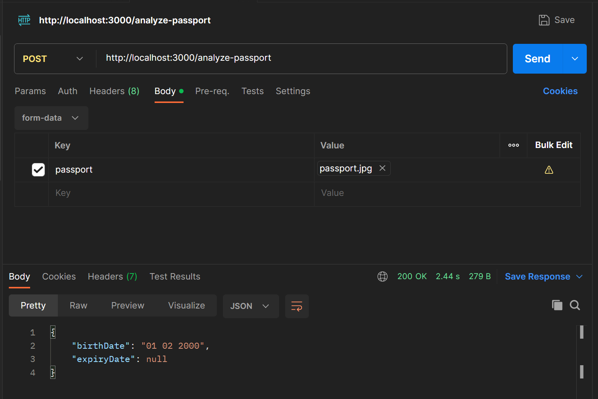

# passport-api
A simple typescript REST API which takes in a passport image and fetches the Date of Birth & Date of Expiry from the image with the help of a third party OCR API. 

## Run the project in your local environment
Run the following command to install all the dependencies for this project:

`npm ci`

After ensuring the environment variables are set in place, start the application using the following command: 

`npm start`

## Environment Variables

```
PORT=3000
OCR_API_KEY = 'ocr-api-key-string-here'
```

## How to test the API in Postman?
Since the service isnt deployed anywhere, the endpoint will be `http://localhost:3000/analyze-passport`. The method is a POST and the passport image that needs to be uploaded, should be uploaded via Body using form-data. The name of the passport file should be `passport.jpg`. As of this implementation, only jpg formats are acceptable. A screenshot is attached below for referal: 


